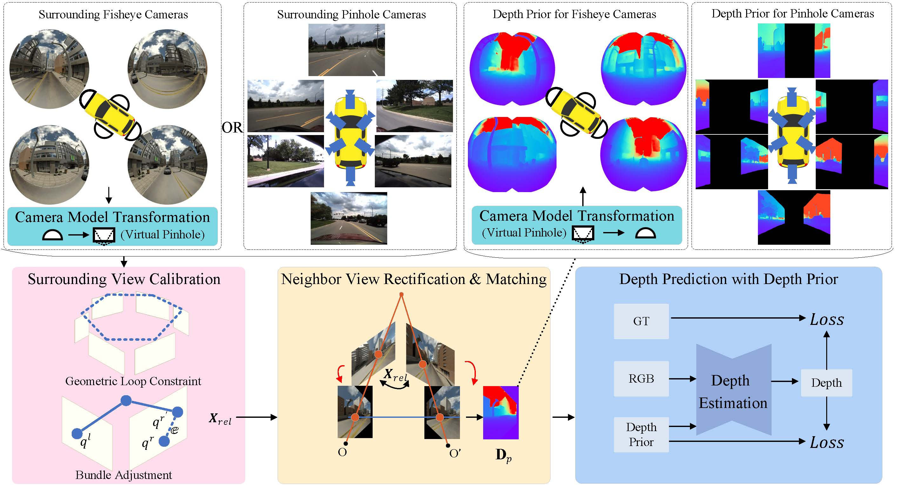
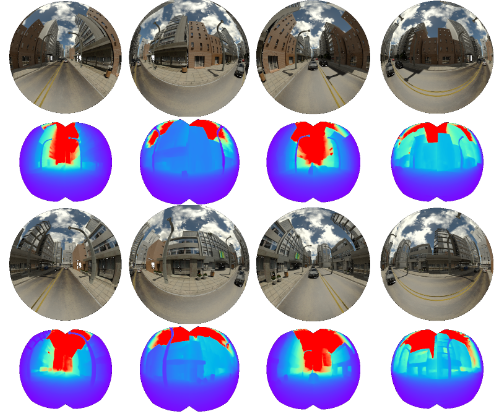

# 🚀 SGDE Project 🚀
**Official PyTorch implementation of SGDE**

[SDGE: Stereo Guided Depth Estimation for 360°Camera Sets]()

## News
-`[2024/6/30]` SGDE accepted by IROS 2024 (oral) !

##  🌼 Abstract

SGDE is a stereo frame for depth estimation from multiple pinhole/fisheye images at any viewpoint. It includes multi-view calibration, stereo rectification , stereo depth estimation and other basic algorithms. It allows you to use existing SOTA algorithms to predict any image with overlapping regions without training model.

## 🌈 DEMO
  

## 🔨 Installation

